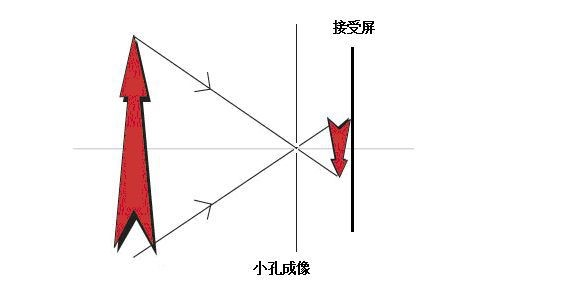

<!-- @import "[TOC]" {cmd="toc" depthFrom=1 depthTo=6 orderedList=false} -->

<!-- code_chunk_output -->

- [光](#光)
  - [反射定律](#反射定律)
    - [光的基础知识](#光的基础知识)
    - [反射](#反射)
    - [**镜面反射与漫反射**](#镜面反射与漫反射)
    - [光路可逆性](#光路可逆性)
  - [平面镜成像](#平面镜成像)
    - [平面镜成像的特点](#平面镜成像的特点)
    - [实像与虚像](#实像与虚像)
    - [凸面镜与凹面镜](#凸面镜与凹面镜)

<!-- /code_chunk_output -->

# 光

## 反射定律

### 光的基础知识
* 光的传播方式
    在均匀物质中沿直线传播
    * [现象](https://www.bilibili.com/video/av73336764/)

* 平行光与日光
    * 日光的角度

* 光的表示方式
    * 光线的画法
    * 平行光的画法

* [小孔成像](https://www.bilibili.com/video/av30236239/)

* ==课堂思考题==
    * [F 的小孔成像](https://www.bilibili.com/video/av30236239)

* 光速
    * $ 3 \times 10^8 m/s  $
    * 远大于声速

### 反射

* 定义
    光射到物体表面时，被物体表面反射回去
* [现象](https://www.bilibili.com/video/av54492734/)
* 基本概念
    * 入射点
    * 法线
    * 入射角
    * 反射角
* 反射规律
    * 共面
    * 两侧
    * 角度相等
* 光路图

### **镜面反射与漫反射**

* 定义
* “看”到物体的条件？
* ==课堂思考题==
    * 暗室
    * 平面镜
    * 手电
* 幕布
* 黑板反光
* 漫反射的意义

### 光路可逆性

* 定义
    当光线逆着原来的反射光线（或折射光线）的方向射到媒质界面时，必会逆着原来的入射方向反射（或折射）出去的性质。
* 应用
    * **互相看见**
    A 能在镜子里看见 B ，B 是否能看见 A
    * 测试题
        * [图片](./images/keni.png)

## 平面镜成像

### 平面镜成像的特点

* [实验现象](https://www.bilibili.com/video/BV1Wa4y1i75K/)
* 虚像
* 对称
    * 大小相同
        * 注意仔细解释
    * 距离相等

### 实像与虚像
* ==**像是什么**==
* 定义与判断方法
    * 是否有真实光线
    * 是否能被光屏接收
    * **人眼看到的方式不同**
* 实像的例子
* 虚像的例子

### 凸面镜与凹面镜

* [成像情况](https://www.bilibili.com/video/av31099031/)
    * 凸面镜
    * [凹面镜](https://v.qq.com/x/page/b0545301fi7.html)
* 应用
    * [凸面镜应用](http://www.iqiyi.com/w_19rt7e1xfd.html)
    * 凹面镜应用
        * 太阳灶与圣火
        * 高增益天线
        * 灯罩