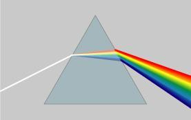
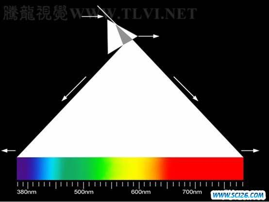

# 20191207

## 目录

<!-- @import "[TOC]" {cmd="toc" depthFrom=1 depthTo=6 orderedList=false} -->

<!-- code_chunk_output -->

- [20191207](#20191207)
  - [目录](#目录)
  - [光的色散](#光的色散)
    - [色散](#色散)
    - [拓展：光的波长与频率](#拓展光的波长与频率)
    - [颜色的本质](#颜色的本质)
  - [凸透镜成像](#凸透镜成像)
    - [凸透镜](#凸透镜)
    - [凸透镜成像规律](#凸透镜成像规律)

<!-- /code_chunk_output -->

## 光的色散

### 色散

* [色散现象](https://www.bilibili.com/video/av17292435/)
* [色散与彩虹](https://www.bilibili.com/video/av31098973?p=1)
* 特点
    * 颜色连续变化
    * 红、橙、黄、绿、蓝、靛、紫
    * 各个颜色分布不均
* **物体的颜色**
    * 物体的颜色是其反射光/投射光的颜色
    * 颜色的小测试
    * [现象](https://www.bilibili.com/video/av17292435/)
* 为什么色散？
### 拓展：光的波长与频率

* $ c = \lambda \times \nu $
* 波长越长，频率越低

### 颜色的本质

    人眼、人脑对于不同波长光线的不同处理
* [人眼是如何看到颜色的](https://www.bilibili.com/video/av62950614/)

## 凸透镜成像

### 凸透镜
    又叫汇聚透镜
    两个表面，至少一个表面是球面

* 结构与定义
    * 主光轴/光轴
    * 光心
        * 通过光心，传播方向不变
    * 焦点
    * 焦距
* 光学特点
    * 平行光汇聚于一点
        * 平行于主光轴时汇聚于焦点
        * 不平行时汇聚于焦平面
    * 作图
        * 两根主要光线

### 凸透镜成像规律

* **凸透镜成像作图**
    * [抓住两根主要光线](https://www.bilibili.com/video/av44687393/)

* ==小测试==
    * 若小孔成像的孔为三角形，成像效果如何
    * 若凸透镜缺损，成像效果如何

* 凸透镜成像规律
$$ \frac{1}{u} + \frac{1}{v} = \frac{1}{f} $$

